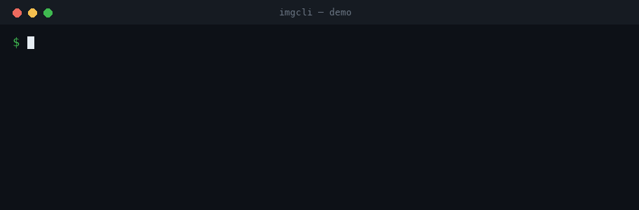

# imgcli — command-line image conversion & processing in C

**A dependency-free CLI to convert, resize, crop, filter, and composite images** —
PNG, JPEG, BMP, TGA, GIF, and PPM — driven by an ffmpeg-style filtergraph. One
small C binary, no system libraries, compiles anywhere a C11 compiler exists.

> If you're looking for a lightweight **image converter / image processing
> library** for the command line — a tiny alternative to ImageMagick `convert`
> or `ffmpeg` for still images — this is it.



```sh
# Convert + resize + filter in one pass:
imgcli -i photo.jpg -vf "scale=1024:-1,grayscale,contrast=1.2,gblur=1.5" out.png
```

**What it does:** format conversion · resize / scale · crop · pad · rotate · flip ·
brightness / contrast / saturation / gamma / hue · grayscale · sepia · invert ·
threshold · box & Gaussian blur · sharpen · Sobel edge detect · emboss · custom
convolution kernels · alpha-composite overlay · draw boxes · solid fills.

**Design:** the same paradigm as ffmpeg — *decode → normalize to one common frame
format (RGBA) → run a comma-separated filtergraph → encode by output extension.*

## Dependencies & formats

The **default build is dependency-free** — a single binary that links only the
system C library (`libc`). Decoding/encoding is handled by the bundled,
public-domain [stb](https://github.com/nothings/stb) single-header libraries,
compiled directly in. Nothing to `apt install`, no shared libraries, no version
hell.

- **Built-in formats — no dependencies:** PNG, JPEG, BMP, TGA, GIF, PPM. Future
  formats that can be implemented in plain C (e.g. TIFF, QOI) will also be built
  in and keep the binary dependency-free.
- **Formats that need external libraries — opt-in only:** **WebP, AVIF, and HEIC**
  cannot be decoded without large external libraries (libwebp, libavif, libheif);
  there is no public-domain single-header decoder for them and they are not
  practical to hand-roll. If imgcli adds these, it will be **strictly via opt-in
  build flags** (e.g. `make WEBP=1`) that link those libraries.

> **The "zero dependencies" claim applies to the default build, and always will —
> opt-in format libraries are never compiled into it.** A build that enables such
> a flag is, by definition, no longer dependency-free, and that trade-off is
> stated at the point you opt in.

## Why it's structured this way

| ffmpeg concept        | imgcli equivalent                                            |
| --------------------- | -------------------------------------------------------------- |
| `AVFrame` / pixfmt    | every image is normalized to packed 8-bit **RGBA** (`Image`)   |
| demuxer/decoder       | `img_load` via vendored **stb_image** (PNG/JPEG/BMP/TGA/GIF/…)  |
| `-vf` filtergraph     | `name=a:b:c, name, …` chain parsed in `filters.c`              |
| `AVFilter`            | each filter mutates or replaces the current frame              |
| muxer (by extension)  | `img_save` (png/jpg/bmp/tga + a hand-written PPM writer)        |
| `lavfi` test sources  | `testsrc=`, `color=`, `gradient=`, `checker=` generators       |

Codecs come from the public-domain [stb](https://github.com/nothings/stb)
single-header libraries (`third_party/`). They're bundled, not linked, so the
tool stays portable and self-contained while still reading/writing the formats
the world actually uses — the same trade-off ffmpeg makes by leaning on codec
libraries instead of reinventing them.

## Install

```sh
# Homebrew (macOS / Linux)
brew install swperb/tap/imgcli

# Prebuilt binaries: https://github.com/swperb/imgcli/releases

# From source (only a C compiler and -lm required)
make            # produces ./imgcli
make demo       # generates a few sample images
sudo make install   # installs to /usr/local/bin
```

### Use it as a native agent tool (MCP)

An [MCP](https://modelcontextprotocol.io) server wraps imgcli so AI agents can
call `convert_image`, `probe_image`, and `list_filters` directly — see
[mcp/](mcp/README.md).

## Usage

```
imgcli [-i INPUT]... [-vf GRAPH] [-q N] [-y|-n] [--json] [--quiet] OUTPUT

  -i INPUT     a file, or a generator (testsrc=WxH, color=NAME:WxH,
               gradient=WxH, checker=WxH). Repeat -i for compositing inputs;
               the first is the primary frame, the rest feed `overlay`.
  -vf GRAPH    filtergraph, e.g. "scale=800:-1,grayscale,gblur=2"
  -q N         JPEG quality 1..100 (default 90)
  -y / -n      overwrite / never overwrite the output
  --json       emit one machine-readable JSON result line (for scripts/agents)
  --quiet      suppress the human-readable success line
  --dry-run    validate the filtergraph + report output dims; write nothing
  -filters     list every filter (add --json for a machine-readable list)
  -info        print input dimensions and exit
  -V           print version
  -h           help
```

Colours accept `#rgb`, `#rrggbb`, `#rrggbbaa`, `0x…`, `r-g-b[-a]`, or names
(`red`, `white`, `transparent`, …). No commas, so they're safe inside a graph.

## Filters

**Geometry** — `scale=W:H[:nearest|bilinear]` (`-1` keeps aspect),
`crop=W:H[:X:Y]`, `pad=W:H[:X:Y[:color]]`, `hflip`, `vflip`,
`transpose=90|180|270`, `rotate=DEG[:color]` (arbitrary angle, canvas expands).

**Colour** — `grayscale`, `invert`, `sepia`, `brightness=V`, `contrast=V`,
`saturation=V`, `gamma=V`, `hue=DEG`, `threshold=V`, `opacity=V`, `tint=color`.

**Convolution** — `blur=R` (box), `gblur=SIGMA` (separable Gaussian),
`sharpen[=AMOUNT]`, `edge` (Sobel), `emboss`, `convolution=K[:DIV:BIAS]`
(custom N×N kernel, e.g. `convolution=0 -1 0 -1 5 -1 0 -1 0`).

**Composite / draw** — `overlay=X:Y[:INDEX]` (alpha "over" compositing of
another `-i` input), `fill=color`, `drawbox=X:Y:W:H:color[:fill|thickness]`.

## Examples

```sh
# Thumbnail, preserving aspect ratio
imgcli -i photo.jpg -vf "scale=400:-1" thumb.png

# Stylise: desaturate a touch, boost contrast, soften
imgcli -i photo.jpg -vf "saturation=0.6,contrast=1.15,gblur=1" look.jpg

# Watermark a logo in the top-left, 60% opacity, then convert to JPEG
imgcli -i page.png -i logo.png -vf "opacity=0.6,overlay=24:24" out.jpg

# Rotate 30° onto a transparent canvas
imgcli -i sticker.png -vf "rotate=30:transparent" rotated.png

# No input file? Generate a test card.
imgcli -i testsrc=640x480 card.png
```

## For AI agents & scripting

imgcli is built to be a reliable tool in an automated pipeline: **one
self-contained binary, no dependencies, deterministic, non-interactive, and
machine-readable**. See [AGENTS.md](AGENTS.md) for a token-economical recipe sheet.

```sh
# Always pass -y (don't prompt) and --json (parseable result) in automation:
imgcli --json -y -i in.jpg -vf "scale=512:-1" out.png
# -> {"ok":true,"output":"out.png","width":512,"height":341,"format":"png","bytes":34122}
```

- **Deterministic & non-interactive** — never prompts; refuses to overwrite
  without `-y`; one process per conversion.
- **Structured output** — `--json` for results, `--quiet` to silence chatter;
  stable exit codes (`0` ok, `1` runtime error, `2` usage error).
- **No network, no subprocesses** — safe to run on untrusted inputs in a sandbox.
- **Probe without converting** — `imgcli --json -info -i file.jpg`.

## Security

imgcli decodes untrusted image files in C, so memory safety is taken seriously.
The codebase has been audited against the OWASP Top 10, common C/CWE classes, and
ffmpeg's historical vulnerability classes. Highlights:

- **Decompression-bomb safe** — dimensions are validated from the header *before*
  pixels are decoded; hard caps on size (16384 px/axis, 64 Mpx).
- **Integer-overflow-safe allocation** through a single capped choke point.
- **No protocols/URLs/subprocesses** — ffmpeg's worst class (SSRF / file-read via
  HLS playlists) is structurally impossible here.
- **Hardened build** (`_FORTIFY_SOURCE`, stack protector, PIE/RELRO, format
  warnings), **ASan/UBSan** (`make asan`), and a **fuzz harness** (`make fuzz`).

Full threat model, OWASP/CWE mapping, ffmpeg-CVE-class analysis, and dependency
policy: **[SECURITY.md](SECURITY.md)**.

## Layout

```
src/image.{h,c}    Image (RGBA frame) + load/save (stb glue, PPM writer)
src/filters.{h,c}  filtergraph parser + every filter + registry
src/source.{h,c}   synthetic input generators
src/util.{h,c}     colour / size parsing
src/main.c         CLI argument handling (incl. --json output)
third_party/       vendored stb_image.h, stb_image_write.h (public domain)
fuzz/              libFuzzer harness for the decode -> filtergraph path
AGENTS.md          token-economical usage guide for agents/scripts
SECURITY.md        threat model, OWASP/CWE mapping, hardening, dependency policy
```

## Contributing

Contributor setup, validation targets, filter-registry guidance, and PR expectations live in [CONTRIBUTING.md](CONTRIBUTING.md).

Have a question or idea? Use [Discussions](https://github.com/swperb/imgcli/discussions). For bugs and feature/format requests, open an issue — the templates will guide you.

## Support

If imgcli is useful to you, consider [sponsoring its development](https://github.com/sponsors/swperb) — it funds new formats, security hardening, and maintenance. See [SPONSORS.md](SPONSORS.md).

## License

The imgcli source is yours to use freely. The vendored stb headers are
public domain (see their headers).
